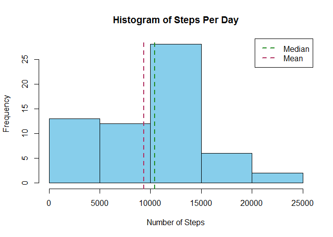
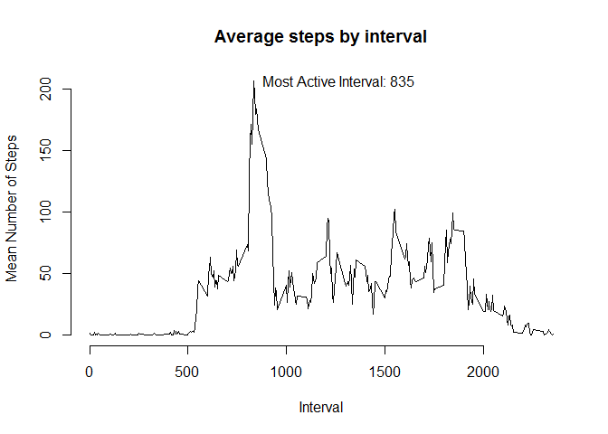
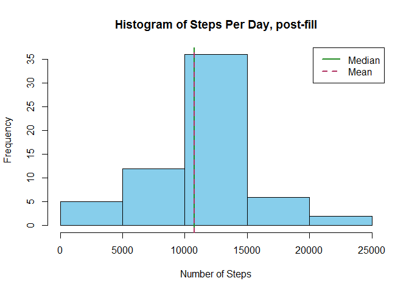
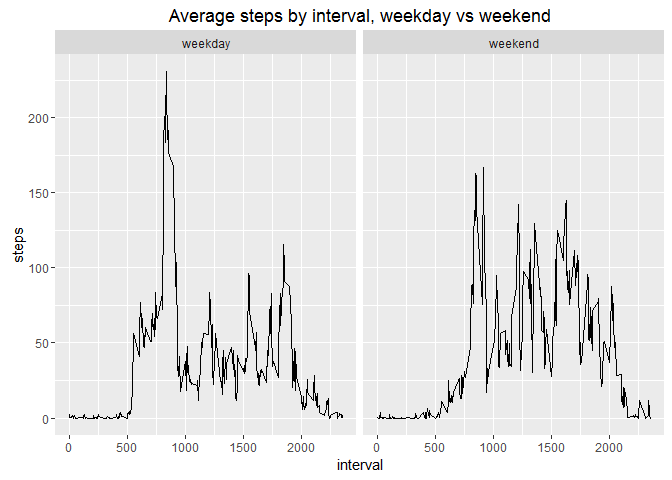

# Reproducible Research: Peer Assessment 1


# 1. Loading and preprocessing the data

#### a. Load raw data from file

```r
    dataRaw <- read.csv("activity.csv")
```
    
# 2. What is mean total number of steps taken per day?

#### a. Calculate daily totals of steps

```r
    dayData <- dataRaw %>% group_by(date) %>% summarize(daySteps = sum(steps, na.rm = TRUE))
```
#### b. Calculate the mean and median of total steps per day

```r
dayStepsMedian <- median(dayData$daySteps)
dayStepsMedian
```

```
## [1] 10395
```

```r
dayStepsMean <- mean(dayData$daySteps)
dayStepsMean
```

```
## [1] 9354.23
```
#### c. Generate histogram of daily steps

```r
hist(dayData$daySteps, col = "skyblue", main = "Histogram of Steps Per Day", xlab = "Number of Steps")

abline(v=dayStepsMedian, col="forestgreen", lty=2, lwd = 2)
abline(v=dayStepsMean, col="maroon", lty=2, lwd=2)

legend("topright", c("Median","Mean"), col = c("forestgreen","maroon"), lty=2, lwd = 2)
```



## 3. What is the average daily activity pattern?
#### a. Calculate interval averages of steps

```r
    intData <- dataRaw %>% group_by(interval) %>% summarize(intSteps = mean(steps, na.rm = TRUE))
```
#### b. Find the maximum step interval

```r
maxInt <- intData[which(intData$intSteps == max(intData$intSteps)),]
maxInt
```

```
## Source: local data frame [1 x 2]
## 
##   interval intSteps
##      (int)    (dbl)
## 1      835 206.1698
```
#### c. Plot a line graph of average steps per interval

```r
plot(intData$interval, intData$intSteps, type = "l", frame.plot = FALSE,
     main = "Average steps by interval", xlab = "Interval", ylab = "Mean Number of Steps")

text(x=maxInt$interval, y=maxInt$intSteps, labels = paste0("Most Active Interval: ", maxInt$interval), pos = 4)
```



## 4. Imputing missing values

#### a. Find the number of missing rows (steps == NA)

```r
  noMissing <- nrow(dataRaw[which(is.na(dataRaw$steps)),])
  noMissing
```

```
## [1] 2304
```
#### b. Merge the full dataset with the calculated averages per interval

```r
  dataFill <- data.table(merge(dataRaw, intData, all=TRUE, sort=FALSE))
  head(dataFill)
```

```
##    interval steps       date intSteps
## 1:        0    NA 2012-10-01 1.716981
## 2:        0     0 2012-11-23 1.716981
## 3:        0     0 2012-10-28 1.716981
## 4:        0     0 2012-11-06 1.716981
## 5:        0     0 2012-11-24 1.716981
## 6:        0     0 2012-11-15 1.716981
```
#### c. Add flags to help identify which rows are raw, and which are imputed

```r
  dataFill[is.na(steps), flag := "fill"]
  dataFill[!is.na(steps), flag := "raw"]
  head(dataFill)
```

```
##    interval steps       date intSteps flag
## 1:        0    NA 2012-10-01 1.716981 fill
## 2:        0     0 2012-11-23 1.716981  raw
## 3:        0     0 2012-10-28 1.716981  raw
## 4:        0     0 2012-11-06 1.716981  raw
## 5:        0     0 2012-11-24 1.716981  raw
## 6:        0     0 2012-11-15 1.716981  raw
```
#### d. Replace the NA step values with the average # of steps for that interval, rounded to nearest integer

```r
  dataFill[flag == "fill", steps := as.integer(round(intSteps,0))]
  head(dataFill)
```

```
##    interval steps       date intSteps flag
## 1:        0     2 2012-10-01 1.716981 fill
## 2:        0     0 2012-11-23 1.716981  raw
## 3:        0     0 2012-10-28 1.716981  raw
## 4:        0     0 2012-11-06 1.716981  raw
## 5:        0     0 2012-11-24 1.716981  raw
## 6:        0     0 2012-11-15 1.716981  raw
```
#### e. Calculate daily totals of steps with filled dataset

```r
  dayFillData <- dataFill %>% data.frame() %>% group_by(date) %>% summarize(daySteps = sum(steps, na.rm = TRUE))
```
#### f. Calculate new mean and median for steps per day

```r
  dayFillStepsMed <- median(dayFillData$daySteps)
  dayFillStepsMed
```

```
## [1] 10762
```

```r
  dayFillStepsMean <- mean(dayFillData$daySteps)
  dayFillStepsMean
```

```
## [1] 10765.64
```
#### g. Plot histogram of daily steps with filled dataset

```r
  hist(dayFillData$daySteps, col = "skyblue", main = "Histogram of Steps Per Day, post-fill", xlab = "Number of Steps")

  abline(v=dayFillStepsMed, col="forestgreen", lty=1, lwd = 2)
  abline(v=dayFillStepsMean, col="maroon", lty=2, lwd=2)
  
  legend("topright", c("Median","Mean"), col = c("forestgreen","maroon"), lty=c(1,2), lwd = 2)
```




## 5. Are there differences in activity patterns between weekdays and weekends?
#### a. Determine the weekday for each date in filled dataset

```r
  dataFill[,wday := weekdays(as.Date(date),abbreviate=TRUE)]
  head(dataFill)
```

```
##    interval steps       date intSteps flag wday
## 1:        0     2 2012-10-01 1.716981 fill  Mon
## 2:        0     0 2012-11-23 1.716981  raw  Fri
## 3:        0     0 2012-10-28 1.716981  raw  Sun
## 4:        0     0 2012-11-06 1.716981  raw  Tue
## 5:        0     0 2012-11-24 1.716981  raw  Sat
## 6:        0     0 2012-11-15 1.716981  raw  Thu
```
#### b. Assign each row as either "weekend" or "weekday"

```r
  dataFill[wday %in% c("Sat","Sun"), dayType := "weekend"]
  dataFill[!(wday %in% c("Sat","Sun")), dayType := "weekday"]
  head(dataFill)
```

```
##    interval steps       date intSteps flag wday dayType
## 1:        0     2 2012-10-01 1.716981 fill  Mon weekday
## 2:        0     0 2012-11-23 1.716981  raw  Fri weekday
## 3:        0     0 2012-10-28 1.716981  raw  Sun weekend
## 4:        0     0 2012-11-06 1.716981  raw  Tue weekday
## 5:        0     0 2012-11-24 1.716981  raw  Sat weekend
## 6:        0     0 2012-11-15 1.716981  raw  Thu weekday
```

#### c. Summarize into a data frame, calculating the mean steps by interval and day type

```r
  dataFilldf <- dataFill %>% data.frame() %>% group_by(interval,dayType) %>% summarize(steps = mean(steps, na.rm = TRUE))
  head(dataFilldf)
```

```
## Source: local data frame [6 x 3]
## Groups: interval [3]
## 
##   interval dayType     steps
##      (int)   (chr)     (dbl)
## 1        0 weekday 2.2888889
## 2        0 weekend 0.2500000
## 3        5 weekday 0.4000000
## 4        5 weekend 0.0000000
## 5       10 weekday 0.1555556
## 6       10 weekend 0.0000000
```
#### d. Plot the average steps per interval in two chats, one for weekday and one for weekend

```r
  ggplot(dataFilldf, aes(x=interval,y=steps))+geom_line()+ggtitle("Average steps by interval, weekday vs weekend")+facet_wrap(~dayType)
```



